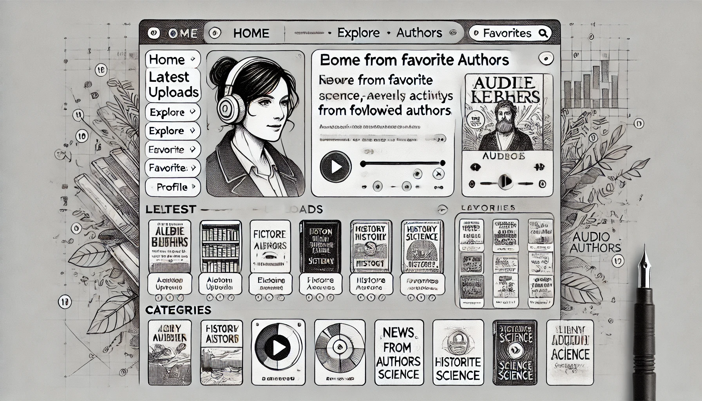
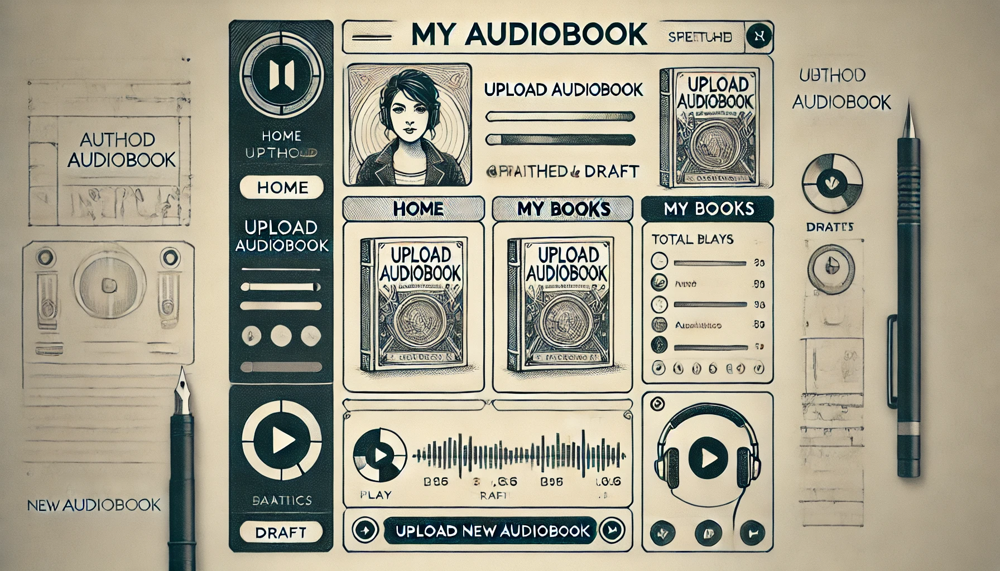

# Narratica-MountainProject-Audiobook

#### **This document is a draft — let’s discuss improvements with the team! 🚀**

### !!! Check the [process](docs/PROCESS.md) for first step when you clone the repo !!!

## 1. Project Description
This project is an **audiobook streaming platform** where users can listen to audiobooks, manage favorites, and interact with structured book collections. The application will have different user roles with specific permissions and a modern frontend built with **React**. The backend will be powered by **Django and Django Rest Framework (DRF)** to manage users, audio files, and authentication.

## 2. Technologies Used

### Frontend:
- **React** (for UI)
- **React Router** (for navigation)
- **Tailwind CSS** (for styling)
- **Axios** (for API requests)
- **React Query** (for data fetching)

### Backend:
- **Django** (Python framework)
- **Django Rest Framework (DRF)** (for API)
- **PostgreSQL** (or SQLite for development)
- **JWT Authentication** (for user login and permissions)
- **Render** (for hosting)
- **Free Audiobook APIs** (exploring options like LibriVox, Open Library)

## 3. Frontend Structure

### **Main Features:**
- **Audio Player**: Always visible across all pages.
- **Homepage**: Displays latest uploads, news from favorite authors, and categorized tags.
- **User Dashboard**: Manage favorites, private playlists, and settings (including dark mode toggle).
- **Author/Publisher Pages**: Managed by users to upload and organize audiobooks (books as playlists, chapters as audio files).
- **Admin Dashboard**: Manage users, content, and system-wide settings.

### **Homepage Details:**
- Displays **latest audiobook uploads**.
- Highlights **news from favorite authors**.
- Includes **tag-based categories** for organizing content.
- **Personalized recommendations** based on user listening history and favorite tags.
- **Search & Filtering**: Users can search by **title, author, or tags** and filter by **multiple tags at once**.

## 4. Backend Structure

### **Key Functionalities:**
- **User Authentication** (Register/Login with JWT, role-based access)
- **Audiobook File Management** (Upload, store, and stream audio files)
- **Playlist & Favorites Management** (Users can create and manage them)
- **Admin Controls** (Manage users and content, approve author pages, moderate audiobooks)
- **Integration with Free Audiobook APIs** (If applicable, these APIs will provide **metadata and external streaming links**.)
- **Caching for External APIs** (To reduce excessive calls and API rate limits.)

### **User Roles & Permissions:**
| Role                 | Permissions                                               |
|----------------------|-----------------------------------------------------------|
| **Guest**            | Listen to extracts of audiobooks, view homepage           |
| **Subscribed User**  | Listen to full audiobooks, add favorites (books, authors) |
| **Author/Publisher** | Upload audiobooks, create public playlists (books)        |
| **Admin**            | Manage users, handle CRUD operations, moderate reports    |

## 5. Database Schema

### **Main Tables:**
1. **User** (Django built-in with custom roles)
2. **UserProfile** (Extends User with roles & permissions)
3. **AuthorPage** (Managed by users for uploading content)
4. **AudioFile** (Stores uploaded audio files)
5. **Playlist/Books** (Managed by AuthorPage to organize content with tags)
6. **Tag** (Associated with audiobooks for categorization, min 1, max 3 per book) => .json in src ?
7. **Favorite** (Links users to favorite books or authors)

## 6. API Endpoints

### **Authentication & User Management**
- `POST /api/register/` → Register a new user
- `POST /api/login/` → Authenticate user (JWT token)
- `POST /api/admin/approve-author/` → Approve author pages (Admin only)
- `POST /api/admin/review-reports/` → Handle user-reported content (Admin only)

### **Audiobook File Management**
### `GET /api/audio/`
**Description**: Retrieve all publicly available audiobooks.  /

---

### `GET /api/audio/{book_id}/`
**Description**: Get detailed information about a specific audiobook, including author, narrator, release date, cover art, and other metadata.

---

### `GET /api/audio/{book_id}/{chapter_number}`
**Description**: Get detailed information about a specific chapter of an audiobook, including the chapter's audio file or extract (if the user is a guest).

---

### `GET /api/audio/new/{(optional)quantity}`
**Description**: Retrieve the latest X uploaded audiobooks.  
**Note**: The quantity parameter is optional.

---

### `GET /api/audio/tag/{tag_id}/{(optional)quantity}`
**Description**: Retrieve the most-viewed audiobooks associated with a specific tag.  
**Note**: The quantity parameter is optional.

---

### `GET /api/audio/author/{author_id}/{(optional)quantity}`
**Description**: Retrieve the most-viewed audiobooks by a specific author.  
**Note**: The quantity parameter is optional.

---

### `GET /api/audio/publisher/{publisher_id}/{(optional)quantity}`
**Description**: Retrieve the most-viewed audiobooks from a specific publisher.  
**Note**: The quantity parameter is optional.

---

### `POST /api/audio/upload/`
**Description**: Upload an audiobook file.  
*Author-only access. Author verification is not enforced at the moment.*  

#### Request Body Parameters:

| Key                        | Type   | Description                                                                 | Required |
|----------------------------|--------|-----------------------------------------------------------------------------|----------|
| `title`                    | string | The title of the audiobook.                                                 | Yes      |
| `description`              | string | A brief description of the audiobook.                                       | No       |
| `author`                   | int    | The ID of the author of the audiobook.                                      | Yes      |
| `narrator`                 | int    | The ID of the narrator for the audiobook.                                   | Yes      |
| `publisher`                | int    | The ID of the publisher of the audiobook.                                   | Yes      |
| `cover_art_jpg`            | string | URL or file path to the cover art image in JPG format.                      | No       |
| `cover_art_thumbnail`      | string | URL or file path to the cover art thumbnail image.                          | No       |
| `language`                 | string | The language in which the audiobook is available.                           | Yes      |
| `tags`                     | int    | A list of tags associated with the audiobook.                               | No       |
| `total_time`               | string | Total duration of the audiobook in the format `hh:mm:ss`                    | No       |
| `total_number_of_listening`| int    | The total number of times the audiobook has been listened to (default = 0). | No       |

---

## **Playlist & Favorites Management**

### `POST /api/playlists/create/`
**Description**: Create a new playlist.

#### Request Body Parameters:

| Key                        | Type   | Description                                                                 | Required |
|----------------------------|--------|-----------------------------------------------------------------------------|----------|
| `name`                     | string | The title of the audiobook.                                                 | Yes      |
| `book`                     | int    | The ID of the audiobook.                                                    | Yes      |
| `user`                     | int    | The ID of the user                                                          | Yes      |

---

### `GET /api/playlists/{id}/`
**Description**: Retrieve the details of a specific playlist.

---

### `POST /api/favorites/audiobook`
**Description**: Add an audiobook to the user's favorites list.

#### Request Body Parameters:

| Key                        | Type   | Description                                                                 | Required |
|----------------------------|--------|-----------------------------------------------------------------------------|----------|
| `user`                     | int    | The ID of the user                                                          | Yes      |
| `book`                     | int    | The ID of the audiobook.                                                    | Yes      |

---
## 7. Roadmap

### **Global Roadmap**
This roadmap follows agile-style iterations to keep things structured.

**🟢 Phase 1: Project Setup & Planning**

✅ Review README & Define Scope

✅ Create GitHub Repository

✅ Choose Database Solution (Render hosting & LibriVox API)

⬜ Gather UI References & Design Discussion

Here is what ChatGPT propose when you ask for an audiobook platform (we can do better!):

And here is what Copilot suggest for the logo (it took some time but I think we have a great starting point!):

**🟡 Phase 2: Backend & API Development**

⬜ Set Up Django Project & Dependencies

⬜ Implement API Endpoints for Users & Audiobooks (with fake DB for front)

⬜ Define User Roles & Authentication (JWT)

⬜ Database Schema & Models

⬜ Audio Upload & Storage Solution

⬜ Set Up Admin Dashboard Features

⬜ Test integration of Free Audiobook APIs (if applicable)

**🟠 Phase 3: Frontend Development**

⬜ Initialize React Project & Dependencies

⬜ Build Core UI Components (Audio Player, Navigation, Dark Mode Toggle, etc.)

⬜ Connect Frontend to API (Authentication, Audio Streaming, etc.)

⬜ Develop User, Author, and Admin Dashboards

⬜ Implement search & filtering (by tags, author, etc.)

**🔵 Phase 4: Testing & Deployment**

⬜ Test Backend API & Fix Bugs

⬜ Test Frontend UI & Refine User Experience

⬜ Implement automated testing (unit tests, integration tests)

⬜ Optimize for Mobile & Performance Improvements

⬜ Deploy Application (Potential Hosting: Railway, Render, Vercel, Netlify)

### **Individual Developer Roadmaps**

**🟢 Backend Dev 1 (Authentication & Users)**
- Set up Django project and database.
- Implement JWT authentication & user roles.
- Build user management endpoints (register, login, profile).
- Create admin dashboard to manage users.

**🟡 Backend Dev 2 (Audiobooks & Playlists)**
- Implement audio file upload & storage.
- Create playlist/book structure & API endpoints.
- Set up search & filtering (by tags, author, etc.).
- Optimize API performance (pagination, caching).

**🟠 Frontend Dev 1 (Core UI & Player)**
- Set up React project structure.
- Build global UI components (navbar, dark mode toggle, layout).
- Implement audio player (always visible).
- Integrate authentication system.

**🔵 Frontend Dev 2 (Dashboards & API Integration)**
- Develop User, Author & Admin dashboards.
- Fetch & display audiobooks, playlists & favorites.
- Implement forms for uploading & managing audiobooks.
- Handle frontend error handling & validation.

### **Bonus Features (If Time Allows)**
- ⬜ **Optimize for mobile & add progressive web app (PWA) features**
- ⬜ **Use tag-based recommendations for users based on listening history**
- ⬜ **Enable rating system for audiobooks**
- ⬜ **Implement editor/publisher company pages**
- ⬜ **Deploy application with a free hosting solution**

**Name suggestions:**
|  A |  C |  D |  H | Name                  | Status |
|----|----|----|----|-----------------------|--------|
| ⬜ | ✅ | ⬜ | ⬜ | ChronicleSounds       | Free   |
| ⬜ | ✅ | ⬜ | ⬜ | EchoTales             | Free   |
| ⬜ | ⬜ | ⬜ | ⬜ | Echo                  | +/-    |
| ⬜ | ⬜ | ✅ | ⬜ | Audiolore             | Free   |
| ⬜ | ⬜ | ⬜ | ⬜ | HarmonicTales         | Free   |
| ⬜ | ⬜ | ✅ | ⬜ | DACH ? -> Dash ? (—)  | Free   | 
| ✅ | ⬜ | ✅ | ⬜ | CHAD ?                | Free   |
| ✅ | ⬜ | ✅ | ⬜ | Voxtales              | Free   |
| ✅ | ⬜ | ⬜ | ⬜ | Audiotales            | Free   |
| ⬜ | ⬜ | ✅ | ⬜ | TaleWave              | Taken  |
| ⬜ | ⬜ | ⬜ | ⬜ | TuneTale              | Taken  |
| ✅ | ✅ | ✅ | ✅ | **Narratica** 🥇      | ???    |
| ⬜ | ⬜ | ⬜ | ✅ | Narravox              | Taken  |
| ⬜ | ✅ | ✅ | ✅ | Narra(tion)Nation     | Taken  |
| ⬜ | ⬜ | ⬜ | ⬜ | Narratales            | Taken  |
| ⬜ | ⬜ | ⬜ | ⬜ | WhisperingPages       | Taken  |
| ⬜ | ✅ | ⬜ | ⬜ | Audivine              | Taken  |
| ⬜ | ⬜ | ⬜ | ⬜ | AudioNation           | Taken  |
| ⬜ | ⬜ | ⬜ | ⬜ | Audiopen              | Taken  |
| ⬜ | ⬜ | ✅ | ⬜ | Audiovel              | Taken  |
| ⬜ | ⬜ | ⬜ | ⬜ | Boodio                | Taken  |
| ⬜ | ⬜ | ⬜ | ⬜ | Librio                | Taken  |
|    |    |    |    |                       |        |
| ✅ | ⬜ | ⬜ | ⬜ | Blablabook            | Free   |
| ⬜ | ⬜ | ✅ | ⬜ | Babelbook             | +/-    |
| ⬜ | ⬜ | ✅ | ⬜ | Babelbul              | Free   |
| ⬜ | ⬜ | ⬜ | ⬜ | Blabelbul             | Free   |
| ⬜ | ⬜ | ⬜ | ⬜ | ...                   | ...    |
